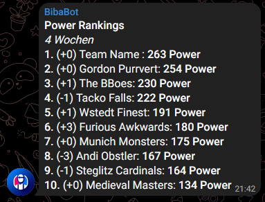
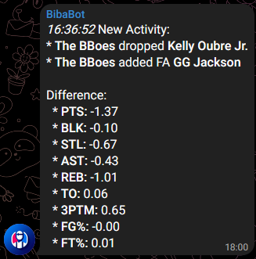

We communicate within a private Telegram Group to discuss all things regarding our ESPN Fantasy NBA league. A few years ago I looked into adding onto that by creating a bot that occasionally posts information about the league. Until last year it was nothing more than a bunch of Python scripts running on one of my Raspberry Pis here at home. For this year I wanted to turn up the notch a bit and integrate the bot with "The Cloud" :trade_mark:.

## Azure Functions and Telegram

This article isn't about creating a Telegram Bot itself, nor is it about integrating it with Azure Functions. I found the existing docs are pretty good on these already:
* [Create a Python Azure Function App](https://learn.microsoft.com/en-us/azure/azure-functions/create-first-function-vs-code-python)
* [Azure Functions Python reference](https://learn.microsoft.com/en-us/azure/azure-functions/functions-reference-python?tabs=get-started%2Casgi%2Capplication-level&pivots=python-mode-decorators)
* [Create a Telegram bot](https://core.telegram.org/bots#3-how-do-i-create-a-bot)
* [Integrate the Telegram Bot to use Azure Functions under the hood](https://www.linkedin.com/pulse/creating-telegram-bot-azure-function-rico-fitra-pratama-vh7oc/)

## espn_api

This post is about writing a bot that queries your ESPN Fantasy NBA league and posts information to a Telegram Group chat. For this I'm using the [unofficial espn_api](https://github.com/cwendt94/espn-api) Python module. After [setting up the credentials](https://github.com/cwendt94/espn-api/discussions/150), which can be a bit tricky to find out, one has access to a lot of data regarding the league:
* Get stats about the players, including free agents
* Query information about recent transactions between managers
* Analyze the teams and their latest matchups

## Developing BibaBot

First I checked out AWS Lambda for hosting the bot and couldn't find a clear path going forward. Next I checked out Azure Functions and it took me 10 minutes to set everything up. The Free Tier allows up to 1 mio executions and 400.000 GB-s, which is way beyond what a small bot like this will consume. In addition it provides some goodies like the following:
* The VSCode integration is awesome
* Integration with App Insights, Log Insights etc to check what's going on internally
* Different types of triggers and further integration into Automation if wanted

The code is [hosted on GitHub](https://github.com/monsdar/bibabot). After going through the tutorials to get everything running I extended the codebase with the following features:
* Unit-tests, allowing me to test the Function locally without having to have the overhead of a (local) deployment
* Integration [with GitHub Actions](https://learn.microsoft.com/en-us/azure/azure-functions/functions-how-to-github-actions) to automate the deployment
* A timer trigger that allows to run the function on its own
* I segregated the [operational code from the integrative code](https://clean-code-developer.com/grades/grade-1-red/#Integration_Operation_Segregation_Principle_IOSP) of the Azure function which helps with reusability, testing and portability
* ...and of course the actual code...

As this is just a small side-project I do not plan to turn this into a fully maintained OSS project, but I'll certainly look into Issues and PRs. If you'd like to use it for your own league feel free to fork and extend with whatever you think would be useful.

## Features

For the time the bot provides the following features:
* Post Power Rankings that show the latest performance of all managers compared to each other. This allows to check whether a team is currently on a run, who's cooling down and whom to look out for until season end:

* Post Transfers, including FA acquisations and trades. This is helpful to keep everyone up-to-date on what's happening. It adds some info where it compares the difference the transfer made:

## Coding Assistant

As [described in a previous post]() I used Tabby to help with creating the bot. I quickly learned its downsides though, as my GTX 3060 wasn't up to the task. While I was sitting besides the equivalent of a vaccuum cleaner going berserk I could either get a proper model running but had very high latency or get quick results while the quality of the suggestions was poor.

During the project I switched to Codeium as a replacement. It's a free alternative to Copilot, and like its bigger brother is completely running in the cloud. It had a few hallucinations with the Azure Python SDK, I guess it just isn't trained a lot with that codebase. But overall it worked very well.

I also enabled the experimental Markdown support, in fact I'm currently writing this article while Codeium is continuously bugging me with suggestions that do not really fit what I'd like to write. So I guess there's still room for improvement there.

Overall I'm happy with Codeium and will stick with it for the time being. After getting used to it I plan to check out their paid subscription and compare it to GitHub Copilot.
