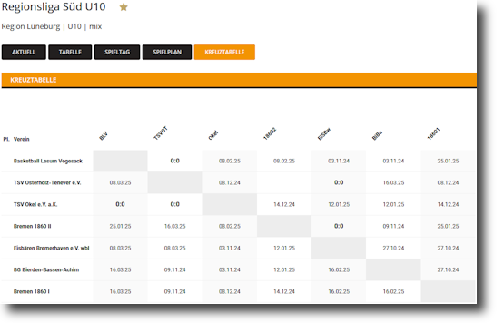


**UPDATE:** Just after publishing the post I noticed [that the BBL page is available in 2 flavors](https://www.basketball-bund.net/index.jsp?Action=101&liga_id=44714). The old JSP page still exists and has an actual ICal Export button. Well... at least I now know how to do it on my own. :see_no_evil:


Every now and then you run into the limits of a website you're using. This just happened to me when my sons basketball coach shared the match schedule and I wanted to add the matches to our family calendar. The info is available through [www.basketball-bund.net](https://www.basketball-bund.net) but you can't get it out of that page easily.

## Time to cook a soup?

A while ago I ran into a similar problem and used BeautifulSoup4 to extract the data I was looking for. This was my first approach as well, but this time it showed to be harder than I thought. Turns out the page loads most of its information dynamically via JavaScript and every approach I tried just returned the skeleton page.

## Plain old REST...

I found the answer when analyzing the sites network traffic through the Firefox Developer Tools. Besides loading a bunch of ads and tracking stuff it was using a plain old REST API to get the standings, teams and schedule. Using `requests` it was easy to get the data I was looking for. The structure contained some odd specialties, but that was to be expected and most of my script works around that easily.

## Writing ICal

Python comes with batteries included, but certainly something like writing ICal data is not part of the framework. Luckily [there's a module called `ical`](https://pypi.org/project/ical/) that helps with that. All I needed to do was to create a new calender, fill it with the events I wanted to have and write it out as an .ics file.

## Source

The code is [hosted in a GitHub repo](https://github.com/monsdar/dbb_ical_extractor), though it's not much more than a few lines of main.py. Perhaps it helps someone else get their team organized in a better way.
