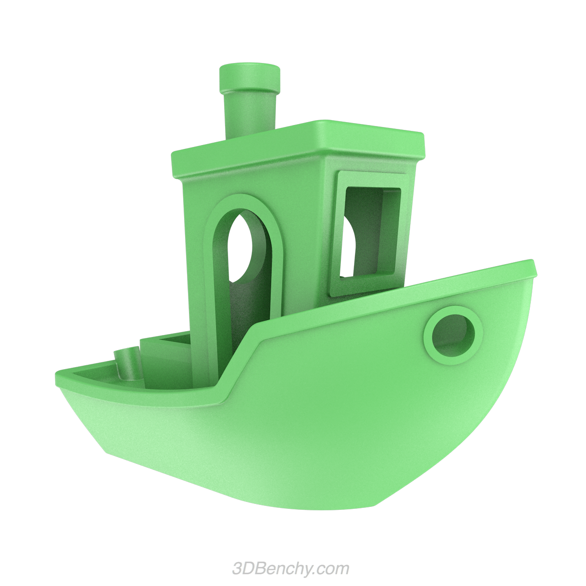
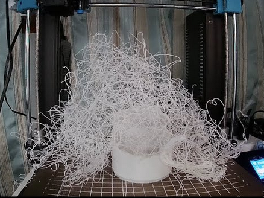

When I occassionally mentioned to my wife that "This would work perfectly if we had a 3D printer" it was mainly me making fun, I never intended to really buy one myself. I knew that just owning the device is only half the story, you need to spend a lot of time to get them tuned just right to print good quality stuff. So besides the hardware you also get a new hobby. When I asked a friend what he's doing with his printer he only replied that "80% is stuff for the printer itself" and this sums it up perfectly.

But the moments where I thought to myself "This would work perfectly if we had a 3D printer" increased a lot over the last month so I began seriously considering it. A friend of mine bought a Sovol SV08 last summer and he was doing a lot of fun stuff with it. So I finally gave in and placed the order. To my surprise it took Sovol only a week to execute the delivery, a company that was notorious for having issues with rollout and where delivery could take many months.

## Wow! Brand-new printer, what now?

After assembling the printer and skipping to tune it (WTF is a Z-Offset?) I tried to print a Benchy. This model is famous for being a good first print, it even came with the printer itself.

It turned out nice, and so did a few other small prints I tried. The kids were flooding me with requests and I even got to repair a broken roller blind. My printer and me were having a nice honeymoon as long as it lasted... But then things began to fall apart.

## End of the honeymoon

It started when I tried to print some bigger things. I read up on the [Honeycomb Storage Wall](https://www.printables.com/model/152592-honeycomb-storage-wall) and wanted to print a few sheets and hangers to organize my working desk as it was flooded with tools I needed for printing. The filament wasn't sticking correctly and I had no idea what could cause that.

Soon after my son wanted to have some Pokemon figurines printed, all with a lot of delicate details. Unfortunately they mostly turned out as spaghetti...

I tried a few times but eventually gave up... It was time to accept that a 3D printer is not as plug and play as I hoped it would be.

## Can I fix it? Yes I can!

And so it was like with every advanced tech: You read a lot, you learn a lot. Luckily 3D printing is very much out there so there are many people giving good advice and share their experiences. In a short form this is what I learned and applied:

* **Usage of Tree Supports:** When a print contains overhangs the printer cannot print them into thin air. You need to print a supporting structure around it. Besides a normal support which is a major PITA to remove from the finished print I saw that my slicer software Orcaslicer supports Tree Supports. These are much smaller and can be removed easily. Bonus is that most of these supports look awesome, I occasionally keep some of the finer ones.
* **Calibrate the Z-Offset:** Hey, there was this calibration thing when I first set up the printer, what was this about? I shortly found that calibrating the Z-Offset makes a huge difference. Not only does it help to set the global Z-Offset but it also helps to properly heat-soak the printer bed and height sensor before doing anything bigger than a benchy.
* **Calibrate for the filament you use:** After finding out about the calibration features of OrcaSlicer I tried different temperature and flow ratio settings for my filaments. It does not change the world, but it's the difference between a somewhat acceptable print and something you could give away as a gift. I started my own filament parameter collection and extend it regularly.
* **Modify the printer:** As my friend said before, most of the things you print in the beginning is stuff for the printer itself. The SV08 was already pretty cool when it came, but building my own enclosure, printing cable chains or replacing the fans made the printer so much better. It's not as loud as before, prints with a higher robustness, i.e. prints do not fail as often, and also looks much nicer.
* **Optimize configuration:** I haven't looked into this as much as I wanted to, but with the SV08 being based on an Open Source design and tooling it's easily possible to extend the menu with your own commands, tinker with advanced configuration and whatnot. I already changed a few things, mainly how it automatically calibrates the Z-Offset before every print, but I'm already thinking about other extensions as well.

## What's next?

Now that I understand the basics ("You know nothing Jon Snow!") I can finally print most of the things you can find on the different model databases like [Thingiverse](https://www.thingiverse.com/) and [Printables](https://www.printables.com/). With holiday season coming up I have a ton of requests from the family again and it's fun to see the results.

But I won't be printing christmas elves forever and there's so much more to figure out. Switching the nozzle? Using different types of filament? Mod the printer a bit more? Not sure what's next, but I'm sure there's still a lot to get figured out. Looking forward to it!
