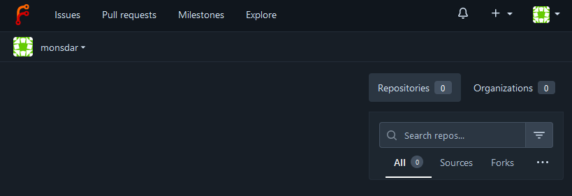

When it comes to Git hosting there are two services that are de-facto standard within their field: While GitHub is perfect for FOSS projects that are out in the open, GitLab is running on most companies on-premise infrastructure. I've been using both of them for well over a decade now and rarely check alternatives *(besides BitBucket, but let's not talk about BitBucket please...)*.

But there are a few more tools nowadays and I thought why not give one of the more popular options a try.

Within this post I'd like to check out Forgejo, a free-as-in-freedom fork of the popular Gitea.

## Setting up Forgejo

For this test I'll set up Forgejo using a docker-compose.yml on my local system. It's as simple as this:

```yaml
version: '3'

services:
  forgejo:
    image: codeberg.org/forgejo/forgejo:9
    container_name: forgejo
    restart: always
    ports:
    - '3000:3000'
    - '222:22'
    environment:
    - DB_TYPE=sqlite3
    - DB_PATH=forgejo.db
    volumes:    
    - ./forgejo.db:/forgejo.db
    - ./forgejo:/data
    - /etc/timezone:/etc/timezone:ro
    - /etc/localtime:/etc/localtime:ro
```

Start it with `docker compose up -d` and the service can be reached at [http://localhost:3000](http://localhost:3000). Now you just need to set it up real quick:

* Go to [http://localhost:3000](http://localhost:3000)
* Check through the configuration options, most of them are good defaults
* Add an admin account or enable self-registration
* Save the config and Forgejo will set itself up

Now you're good to go!

## First impressions

At first sight the UI looks very minimalistic and clean. Before even creating my first repo I can already see that most common features are there: There's a user profile page along with user activity. I can reach repos and pull requests easily. There seem to be a project planning feature, as there's a menu item called *milestones* and lastly it's possible to bundle repositories under the umbrella of organizations.



Within the profile there's a section called `packages` which points to Forgejos ability [to host artifacts](https://forgejo.org/docs/latest/user/packages/) within their native package formats. GitLab and GitHub have the same, but they're [lacking in functionality](https://docs.github.com/en/packages/learn-github-packages/introduction-to-github-packages). Especially with GitLab due to some strange design decisions the package feature is not really usable compared to full-featured artifact hosting services like Artifactory or Nexus. I'm speaking about generics not being able to be stored in subpathes for example.

When creating a repo all the expected options are there. I saw that it's possible to use repository templates, but couldn't find any docs. The [Gitea documentation](https://docs.gitea.com/usage/template-repositories) looks promising though. It won't be as powerful as using a service like [Backstage](https://backstage.io/), but it's good to have a templating mechanism when it comes to building a dev platform.

What I'm missing is something like GitHub Pages, although it seems Codeberg (a Git hosting SaaS provider based on Forgejo) [built it as an extension](https://codeberg.org/coderofsalvation/forgejo-pages-diy).

For the time being I won't go much into Forgejo Actions, as there's already Jenkins on my Todo-list. We'll find some time later on to check on that as well.

## Typical workflow

Next I was going through the typical dev workflow:

* Clone a repo
* Create a new feature branch
* Do some changes
* Push the branch
* Create a Pull Request
* Review and merge that request

Everything was working well, in fact it was feeling a bit too much like GitLab. They even have the feature to prepend `WIP` to the PR title to mark it as work in progress.

The UI to perform the code review is pretty good and has all the needed features:


## Conclusion

Overall the UI looks nice and tidy. It has all the needed features without feeling bloated. Surely GitHub and GitLab have a ton of more features, but that's one of Forgejos main selling points: You don't need most of that - Forgejo provides what's really important to create software efficiently. I don't have much going on in my local instance, but looking at `docker stats` shows that it runs very lightweight in comparison to an empty GitLab.

For the time being it's a good base for further local tests and I'm happy with the result.
