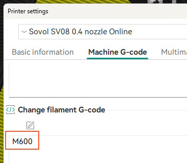
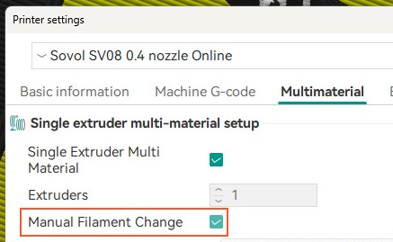
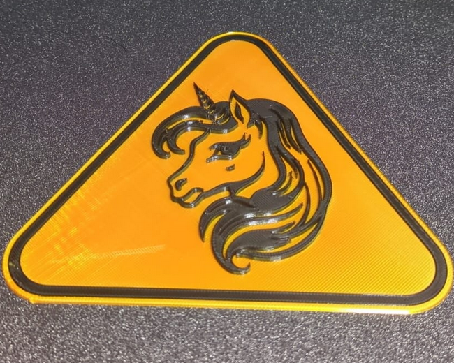
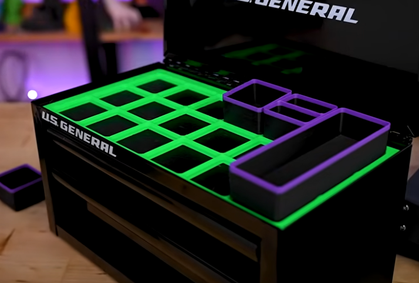

This one's a short one: Being able to use the Sovol SV08 to print unicolor prints is nice, but I wondered for some time if it's possible to switch filaments mid-print to enable printing in different colors.

For some reason there's almost no documentation about this and I needed to find the breadcrumbs in a few different places. Hope this helps someone else to get going faster:

1. Open the Printer Settings in OrcaSlicer
1. Enable Advanced settings
1. Switch to the "Machine G-code" Tab
1. Under "Change filament G-code" enter `M600`
1. Under "Multimaterial" enable "Manual Filament Change"
1. Save the changes to your Printer preset

When setting up your print you can add additional filaments using the "Add one filament" button and setting the right Filament Preset. Then use the "Color Painting" mode to define which layer gets which filament. Using the "Height Range" mode makes editing the object easier. Keep in mind to double-check what you're printing in the "Preview" before sending it to the printer. 

**Now what?** I found that this works perfectly for signs like you could create using the [MakerWorld Signmaker](https://makerworld.com/en/makerlab/makeMySign?from=makerlab):

Another thing I think about is using this to apply some accents onto the top of Gridfinity boxes like Uncle Jessie shows in his [Gridfinity for Dummies](https://www.youtube.com/watch?v=TvIvoY013xQ) video:

