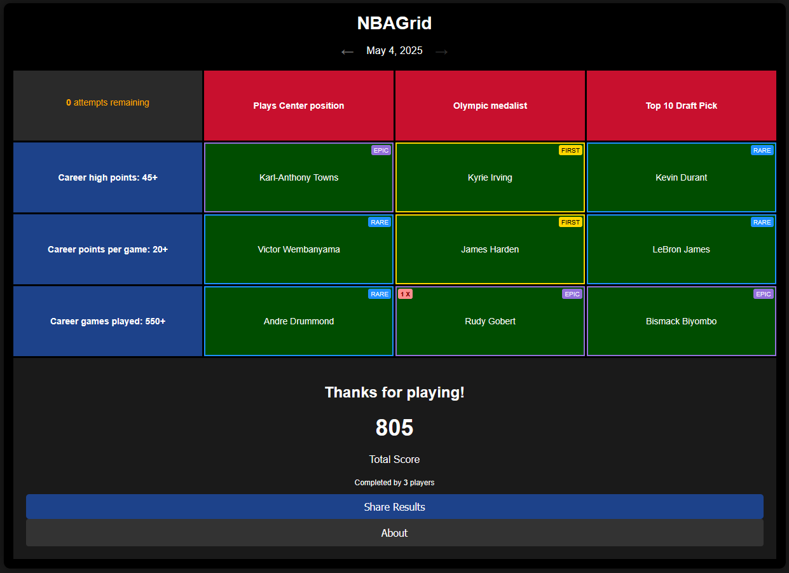
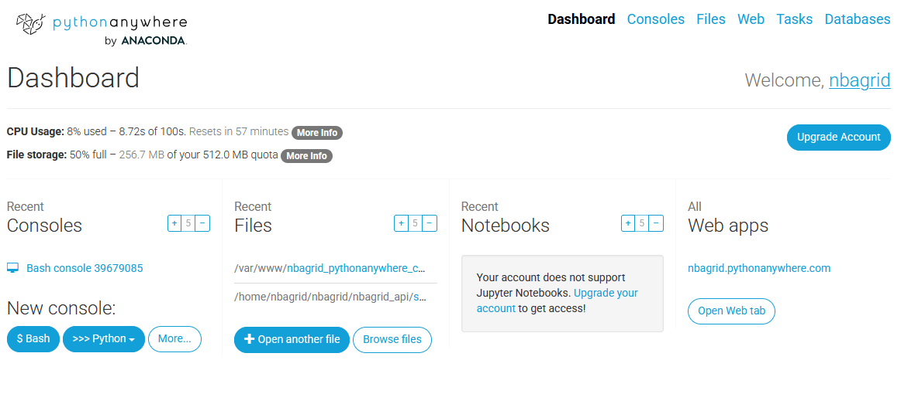
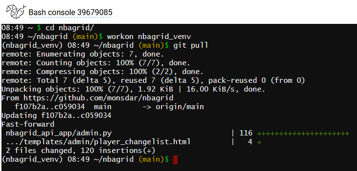

I recently worked on a game called [NBAGrid](https://nbagrid.pythonanywhere.com/) where the user needs to guess NBA players and fill a 3x3 grid. The game is a pretty straight-forward Django application. After the first prototype was running I asked myself where I could host it in the best way. Typical solutions like Azure or AWS seemed overkill for the sake of sharing the game with a few testers.

After searching around a bit I found [PythonAnywhere.com](https://www.pythonanywhere.com). The site offers a free tier to host a small website and provides some ressources in computing and storage to keep it running for the initial few users. On top you also get a MySQL database, which comes in handy if there's some data involved.

The service seems to be originally built around teaching. There are a number of features to share a terminal with students, provide an environment where students can try out things etc.

The biggest issue is the lack of automation. Getting the site running was a matter of opening an interactive terminal, pulling the repository and configuring their WSGI server to run the Django app. It's fine for prototyping, but nowadays running without CI/CD feels pretty naked.

Overall I'll use more mature hosting platforms by the hyperscalers when the game grows out of this early prototyping stage. For the time being it's simple enough to get something running. Thanks for PythonAnywhere LLP for providing this service, I'm sure it helps many devs getting their apps out there in an easy way.
