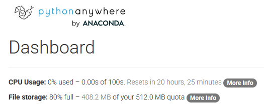
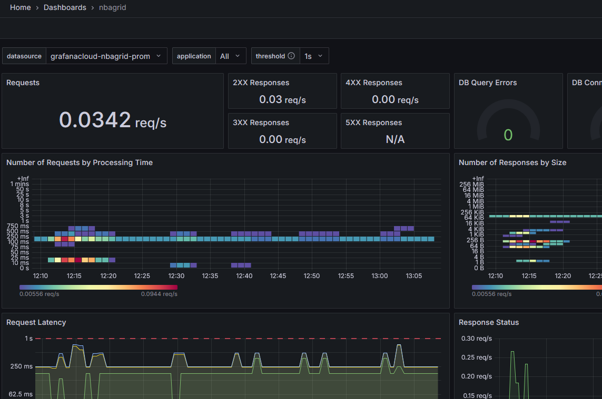

After [deploying NBAGrid to pythonanywhere.com]() the first few users dropped in to check the game out. As the first version of the game had no rankings I didn't even know how many were playing. The free tier of PythonAnywhere provided me with some CPU usage and memory, but without any insights I had no feel about the needed resources and how well it would scale. This line about CPU consumption was all I got:



To change this I turned my head onto Grafana, a service I'm using for several years now and which, due to its flexible architecture, fits almost every usecase when it comes to observability. This time I went with [Grafana Cloud on grafana.com](https://grafana.com/products/cloud/), which offers a free tier for small deployments. For my small game it fits very well.

The onboarding was pretty nice. In comparison to earlier versions there's a wizard-like experience now that leads the user through all the important parts. There's even a built-in version of Prometheus (I guess it's rather Grafana Mimir) that allows to set up a datasource right within Grafana.com.

Speaking of data: Adding Prometheus data to Django was a breeze. The [django-prometheus](https://pypi.org/project/django-prometheus/) module already adds a number of series automatically that can be used to check on performance metrics, HTTP requests and database access. The [public Django dashboard](https://grafana.com/grafana/dashboards/17658-django/) helps to visualize all the data in a very helpful way:



Adding my own data was quickly done as well, thanks to the Prometheus client module:

```
from prometheus_client import Counter, Histogram, Gauge

game_completions_counter = Counter(
    'nbagrid_game_completions_total',
    'Number of completed games',
    ['result']  # 'win', 'lose'
)

game_starts_counter = Counter(
    'nbagrid_game_starts_total',
    'Number of started games'
)
```

Gamewise I'm mainly interested in the user count and how many games have been played. Later on I'm planning to build on this so I can use metrics like correct guesses or picked players to tune the game filters in order to provide a better experience to users.

Regarding the Pythonanywhere computation resources I implemented a call [to their API](https://help.pythonanywhere.com/pages/API/) along with another dashboard and some alerting with Email notifications. This already helped me in finding a disabled service due to the MySQL database not being set up correctly.

Now I know what's going on within the deployment and gamewise. Knowing that an alert will trigger whenever something blows up makes thinking about new users a lot less stressing. I'm looking forward building on top as well, it's easy to think of many interesting data points that could be used.