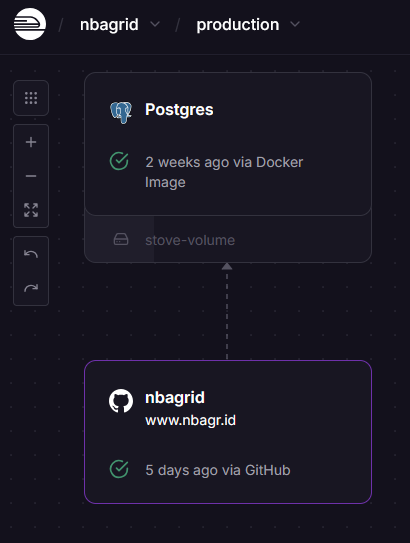

While hosting [NBAGrid on PythonAnywhere]() was a perfect first step in terms of having something available within early development the limits of the platform turned out to be too restrictive. Having to manually `git pull` any changes, doing migrations by hand or reloading the new deployment each time new changes have been made to the codebase is certainly not what I'd consider modern Devops practices.

I checked out alternatives like [Heroku](https://www.heroku.com/) or [Render](https://render.com/), but ultimatively settled with [Railway](https://railway.com/). All these pages provide [comparison-pages](https://docs.railway.com/maturity/compare-to-render) to each other so its pretty transparent what they provide and what features they lack.

Railway felt the most modern and easy-to-get-into for me. Their consumption-based pricing is pretty transparent and support for services like PostgresDB seemed very good. The also provide a Free Trial that I could use to check whether their promises hold true when doing an actual deployment.

## Changes to NBAGrid

In order to prepare the migration I added a few features to the app:

* **Docker Image:** The previous deployment was a baremetal deployment using Djangos manage.py. While this is easily automatable I chose to go a step further and provide a Docker image that has everything included. This way I can easily set up the app on any environment I want. The [Dockerfile](https://github.com/monsdar/nbagrid/blob/main/Dockerfile) uses gunicorn to run the app.
* **GitHub Actions:** With each commit I'd like to generate a new deployable artifact. As the source is hosted on GitHub I chose to [use GitHub Actions](https://github.com/monsdar/nbagrid/blob/main/.github/workflows/docker-build.yml). Building and uploading a Docker Image is straight forward, it's one of the more common usecases for a CI/CD.
* **Postgres Support:** On PythonAnywhere I was simply using a local SQLite database. This isn't scalable at all and data would've been lost when for some reason the app would be redeployed to a different node within their infrastructure. While the database was very small using something more sophisticated like MariaDB or Postgres helps with performance and compute consumption as well.
* **Remove state:** Speaking of redeployments: By moving away from SQLite I was able to remove state from the application. This helps deploying it to different availability zones and enable high availability through replicas. User numbers aren't high enough for this to be a factor right now, but who knows when this comes in handy.
* **Statics with whitenoise:** By using the [`whitenoise`](https://whitenoise.readthedocs.io/en/stable/django.html) module I move the hosting of static files into the app itself. This certainly isn't the most performant solution available (using a cloud CDN would be), but it's good enough for the scale of my app. Most of the static files are part of the Django Admin interface anyways, as the app itself has Javascript and CSS contents directly embedded into the HTML page. I do not have any media data like images or logos within the app for the moment.
* **Extend the API:** I wanted to migrate the more important data from the PythonAnywhere deployment to Railway. I already scraped the NBA statistics once and aren't planning to do this again (besides for updating the existing data). To help with that I added [custom API endpoints](https://github.com/monsdar/nbagrid/blob/main/nbagrid_api/api.py#L118) that help me push this data into the app. With the help of Cursor.ai it was pretty easy to generate [some Python scripts](https://github.com/monsdar/nbagrid/blob/main/sync_teams.py) I can use to migrate the data to its new home (make sure to check the output of the AI before doing something like this, you don't want to end up with unusable data due to a random hallucination).
* **Add deployment-specific settings:** Django apps have settings like `ALLOWED_HOSTS` or `CSRF_TRUSTED_ORIGINS`. These differ from deployment to deployment, so it was needed to make them easily changeable. The [12-Factor-App](https://12factor.net/) guidelines suggest adding this type of configuration to the environment, which I've had good experiences with as well. Therefore I added the [`dotenv`](https://pypi.org/project/python-dotenv/) module to the app, reading all deployment-specific settings from a .env file or variables that I can provide alongside the deployment.

## The actual migration

After I made the necessary changes to the app the migration was pretty straight-forward:

1. First I needed to create a Railway account. I could use GitHub as an auth provider, so this was less than a few clicks. I chose the [Free Trial](https://docs.railway.com/reference/pricing/free-trial) for the time being, which allows for 5$ of resource consumption and 30 days of checking out the service.
1. By linking the NBAGrid GitHub project within Railway you get to see a lot of magic happen: Railway figures out that there's a Django deployment using Gunicorn within a Docker container automatically. It also checks existing GitHub Actions to allow for continuous deployment of the app whenever the repo changes.
1. While Railway automagically figured out 90% of the deployment config I still needed to add a few things myself to feed the settings into the app. This is done via their interface by adding env variables right away. Restarting the app with new vars is just another click so it's easy to check whether everything worked as expected.
1. Adding a Postgres DB was done in another 2 clicks. It's actually crazy how well this worked and I caught myself thinking of potential pitfalls I haven't seen along the way - but there weren't any.
1. After connecting the DB I needed to create a Django super user. This is done via the `manage.py createsuperuser` command and needs to be done manually once per deployment (but then is persisted within the database). I used the `railway ssh` command for that, as it allowed me to run the command right within the deployed Docker container.
1. Now that service and database are set up I only needed to migrate the data. Therefore I took the current SQLite database from PythonAnwhere and used my sync-scripts to push the existing data into my Railway deployment.

After everything was done I had one last step to do: So far I hosted the service under the provided subdomain I got from the deployment service. I didn't like it, but the game was in its early testing, so why bother with buying a domain? In its new home I finally thought it's time to change that. I have a few domains with [Porkbun](https://porkbun.com/) already and I'm happy with their service and prices. Therefore I purchased `nbagr.id` with them as well.

## What's next?

I have a few open tasks on my list still:

* **Monitoring:** Railway provides 5$ / month of resource consumption with its Hobby tier. As far as I can say this will be enough for another couple hundred users per day, but this estimate is based on gut feeling. With PythonAnywhere I had monitoring and alerting to know beforehand when things go out of hand. This is what I need with Railway as well.
* **IaC Config:** Configuring the deployment was straight-forward - if I'd need to I'd be able to redo the config within 15 minutes now that I know where to look at. Nonetheless I never want to do this again - also how do I know that I still know these steps in 2 months from now? What I need is a proper versioned configuration that is part of the NBAGrid repository. Railway provides this feature, so I should start using it.
* **Switch to Hobby Tier:** Right now I'm still running with the free trial. While this is fine it will only last for another couple days. I'll switch to Hobby tier soon - let's see what other features I'll discover after using Railway more frequently for my deployments.

## Summary

In general I'm very impressed about the fidelity of these deployment platforms - not just Railway, but Render and the others as well. They seem to be well integrated with a lot of technologies and abstract the actual Cloud away from the developer so one can focus on software instead of learning Azure basics. All of this while having a pretty good pricetag, especially for smaller deployments like my game.

Long-term I'd like to switch to a deployment that runs directly within one of the hyperscalers. It's fine that Railway is abstracting away most of the cloud-specific configuration - but I want to learn what's under the hood as well. NBAGrid is a perfect real-world application I can take and deploy wherever I want it to be.
