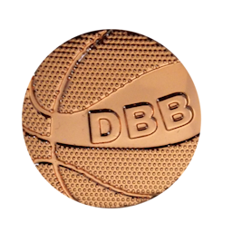
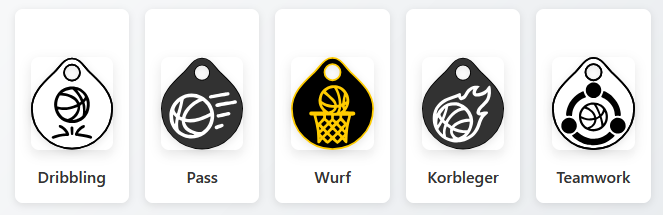
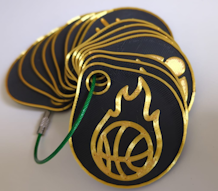

When I'm not playing around with tech I'm a father and a basketball coach. When my 8 yo son started playing and the club asked me to help out as a coach I jumped right in. Now the first season is over - older kids left the team, new kids started learning the basics and my son is somewhat in-between. The next season is far in the future, summer has a lot of other cool things you can do. And of course there's always competition from Nintendo, Netflix and Disney.

I remember this myself when I was his age: After the season ended there was nothing to look forward to and you easily got in a slump.

The answer came right before summer holidays. One of the older coaches approached me and handed me a cardboard box. In there were materials for the [player badges of the DBB](https://www.basketball-bund.de/jugend/spieltreff-und-spielabzeichen/) (German Basketball Association). The idea is simple: As in other sports there are bronze, silver and gold badges that you can earn by showing your skills.

## Bronze Badge

| Type | Challenge |
| --       | --                                          |
| Dribble  | Dribble a distance of 10m with each hand    |
| Pass     | Pass 10 times to someone 3m away            |
| Jumpshot | Hit 1 of 10 shots                           |
| Layup    | Hit 1 of 10 layups                          |
| Game     | Play a game with simplified rules for 5 min |

## Silver Badge

| Type | Challenge |
| --       | --                                      |
| Dribble  | Dribble a slalom of 10m with each hand  |
| Pass     | Pass 3 stationary players while running |
| Jumpshot | Hit 3 of 10 shots                       |
| Layup    | Hit 4 of 10 layups                      |
| Game     | Play a game for 2x 10 min               |

## Gold Badge

| Type | Challenge |
| --       | --                                                              |
| Dribble  | Dribble a slalom of 10m while crossing hands                    |
| Pass     | Pass back and forth with another player while going to the hoop |
| Jumpshot | Hit 7 of 10 shots (or 3 free throws)                            |
| Layup    | Hit 7 of 10 layups                                              |
| Game     | Play a game for 2x 15 min                                       |

> Bonus: While searching for references to put into this post I found that the DBB even published an awesome guide that goes along with the badges and gives a lot of detailed information and ideas for the practice sessions! [Here's the Guide](https://nbbl-basketball.de/wp-content/uploads/2022/02/Be_like_Dirk_Stundenbilder_klein.pdf) as PDF

This is awesome and it helped a lot to keep the kids motivated through the holidays. But is there something else I could do? How far could I ride this?

# We need to go further!

When I talked with some friends about the badges and how much of a success they were we came to the conclusion that it would be awesome to have more of them. We brainstormed a larger number of ideas, and I was keen to take this further.

In comes ChatGPT. It's awesome to explore ideas with it, so I fed the basic concept and a number of ideas and prompted it to fill the gaps - and the result was exceptional! Where I was at a rough concept with 80% of the content being in my head it was the AI that turned it into a polished result. I then used Cursor.ai to generate a static website (using Hugo with a custom theme) which details everything and provides a printable layout so I could create physical handouts for parents and players.

Here are the 5 special badges:

* **Passing**: Show that you can forward the ball precisely and efficient
* **Shooting**: Hit the basket from different positions with a high accuracy
* **Dribbling**: Control the ball with great security, even under high pressure
* **Layup**: The easiest shot is one of the foundational techniques in Basketball
* **Teamwork**: Kids need to learn to be good teamplayers as early as possible

All of these are available in 3 difficulties:

* **Starter**: Show that you've learned the basic skills
* **Profi**: For this you need to master the more advanced techniques
* **Champion**: Only players who are able to operate under pressure are able to achieve these badges

To furthermore support this, I designed the badges myself and printed them with my 3D-printer. It was great fun, now I have a large number of badges my players can add to their collection and show off to their friends.

The page is online at [GitHub Pages](https://monsdar.github.io/basketball_abzeichen/).

