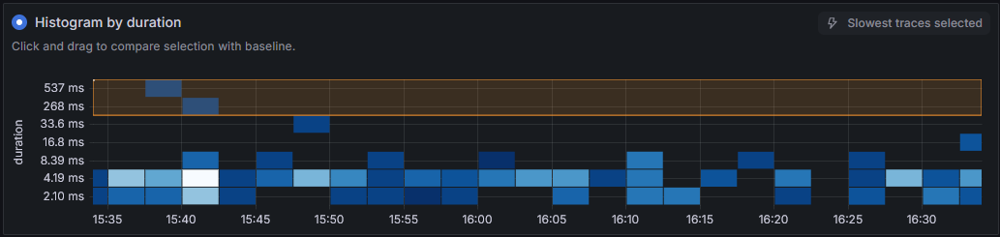
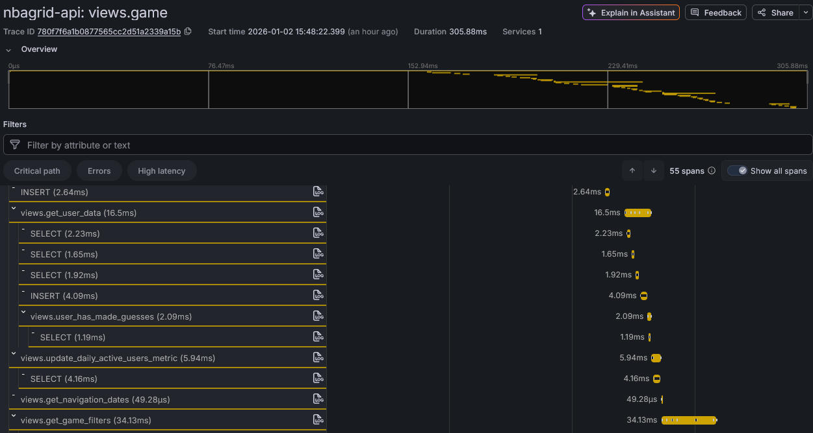

The one thing all cloud providers have in common: You pay for what you use. This was the same with NBAGrid moving to Railway, where I got a monthly bill summing up memory, compute power, storage and network egress. While storage and network was a non-issue I had pretty high cost in computation and memory. This is where I started to investigate on how I could optimize this.

## Effectiveness - Structural changes

Effectiveness is about doing the right thing and stopping to waste effort on parts that aren't really needed. In my past experience software projects tend to turn ineffictive the longer they are being worked on. You start with a pretty simple workflow, but soon add more and more features along the way. Oftentimes what worked in the beginning could be solved way more elegant with newer parts that have been added after the thought. Sometimes learning more about the product you're building uncovers how it is really being used. Here's a list of different learnings I had:

* **Creating new Grids offline:** A large part of NBAGrid is the algorithm to create new grids. It needs to ensure that a new grid is fun to play, so it iterates and tunes the parameters until this goal is reached. By doing this, a lot of database queries (checking guessable players) and computation is used. I have a mirror of the production database on my dev computer, that contains all the NBA player data needed to calculate a grid. By creating a system that calculates new grids on my local hardware I could not only spare the cloud ressources, I also have been able to add much more finetuning to the process. In the end my own PC is much more powerful and is used while developing new features anyways.
* **Using a production DB:** All Django projects start with a local SQLite database by default. While this is fine for testing it easily runs into scaling issues when the application goes into production. Switching the DB to a production-ready PostgreSQL instance not only improved performance, scalability and reliability, it also toned down the computation costs a lot, as the data does not need to stay in memory most of the time.

## Efficiency - Optimizing the app

Efficiency means to do the things you do in an optimized way. While improving for effectiveness means making changes on a product or architecture level, efficiency is mostly improved on the lower levels. When I looked into my loading times for loading the page, checking my stats or making guesses, I had a gut feeling that these are way to slow. Slow loading times not only take a lot of compute power, but also lead to a bad user experience. To further analyze this I added tracing to my code - small annotations to core functions and mechanisms that measure the timespan of its execution.

In Python Django this is very easy to do: With `opentelemetry.trace` loaded I could simply create decorators that automatically attach to any database queries for example. I also manually added decorators to any of my central functions where I expected a lot of time to be used. As a result I can now use Grafana Trace Drilldown anytime I'd like to see further into the internals of the service running.

The general duration histogram is very useful to narrow down the spans to the longer execution times:

I then can simply open up the more detailed trace view to see what parts of the span took too much time:

With this I could find a lot of optimizations:

* Parts in my code were writing to the DB without that being necessary. This was mostly in functions that read data, then writing updates to refresh any timestamps in that data. I did not need the data to be timestamped, so removing this was one of the easier optimizations.
* Functions that read many smaller data objects in a row instead of batching them into a single read operation. This was happening a lot in the part where the user was shown players he could have guessed.
* Entire features that used many DB queries. This was happening in the "stats modal" that opens up when a user finished a Grid. Some of the stats were pretty interesting, but took way too much time to load. Removing them didn't change the user experience a lot, but makes loading the stats much faster.

In the end it was easy to focus on the heavy performance hogs first and then continue working on smaller parts one after another. Simply removing the Top 5 issues already made the app feel like a totally different experience.
