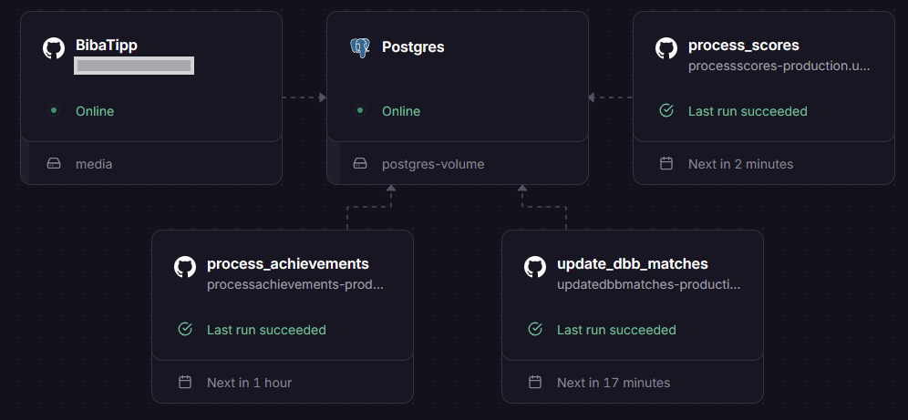
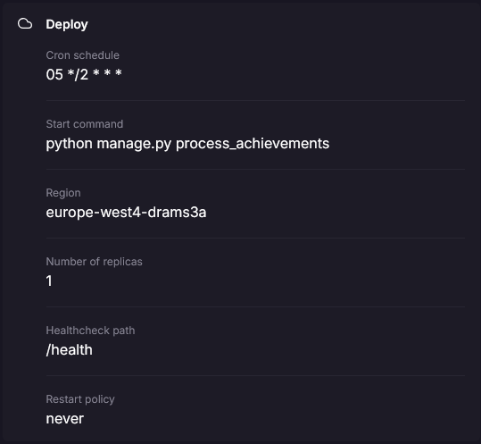

Most of the services I'm running on Railway have some sort of regular management tasks to be done. Earlier I used different approaches to solve this, but all had disadvantages:

* **Local Tasks:** Run the task locally and sync the data up to the service via REST API
  * Does only work when I'm available to run the task on my computer
  * Needs to expose an extra API
  * Some tasks are hard to set up this way, for example updating data that is in the production DB but not available locally
* **Integrated Tasks:** When the first user loads the page after a certain time, run the task as part of the page load
  * Slow loading times for one user
  * Timing conflicts - what if multiple users load the page while the task hasn't finished yet?
  * Convoluted code, as this needs to be included in the code that normally is used for loading the user pages
  * Handling performance is hard. Oftentimes the tasks need more ressources than the code handling user requests

To solve this I found Railway Cronjobs. These are additional services that you add to the deployment that get a one-time start command instead of running continuously. I first started to use them in my NBA prediction game:

Here you can see that while the main "BibaTipp" and "Postgres" instances are running continuously, there are three more services that run on a schedule. The services are connected to the same production database, so they have all the needed data. Implementation-wise I added them as Django management commands, which makes it pretty easy to be integrated into the rest of the application, while the code is still handled separately to the actual app-related code.

Here you can see that the service runs similar to the main service, including most of the variables. I only added a cron schedule and a custom start command:

This way it's also possible to set the right ressources for the task: Operations that can run slower than user-requests can get low CPUs, more complex computations can get more RAM to handle them more efficiently.

Costwise this is also helping a bit: Yes, there's overhead in a container that needs to get started everytime the schedule fires. But that's made up with more fitting per-task ressource-configurations and a general decoupling from user-related code.

Related to this I posted two threads on the Railway board recently, hope they get an answer soon:

* [Show resource usage per service](https://station.railway.com/feedback/show-resource-usage-per-service-in-a-pro-fd99c5a4): It would be awesome to see which service consumes how much resources. This way it'd be possible to further optimize the resource usage.
* [Event-driven tasks](https://station.railway.com/questions/event-driven-deploys-similar-to-cron-jo-f8e83c4f): Instead of running tasks on a schedule it would be helpful to have them run at certain events instead.