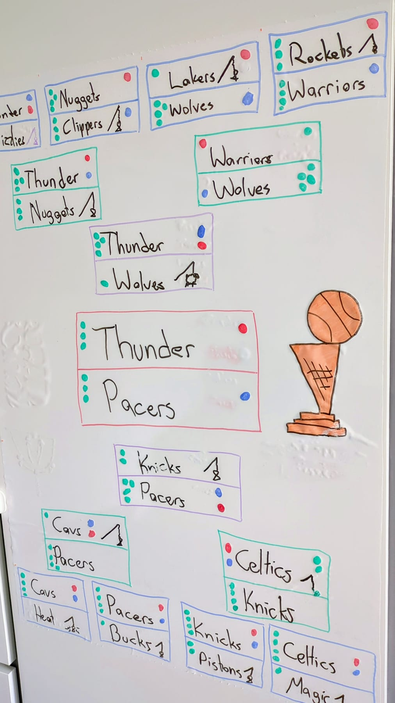
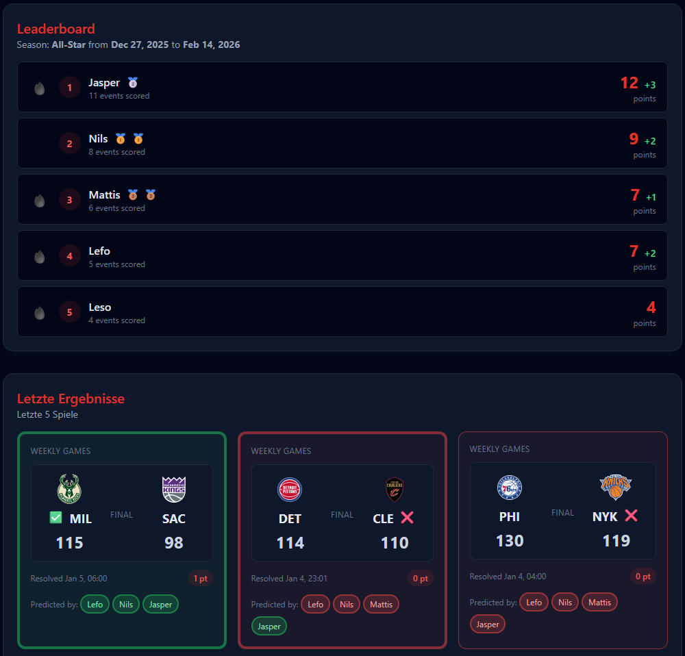

In the past I've often asked myself how I could make sports events more experiencable for my son, who due to his young age has no knowlegde of all the teams, the sport itself or the mode an event is played in. Try to hype someone up for the Fifa Worldcup when he knows nothing about the history of matchups, the teams participating or even how a bracket is played. This gets even more tricky when talking about the Olympics or the NBA Playoffs.

What I've done to solve this is by making up a whiteboard with the brackets, or a leaderboard, and then each day we added who has won and lost and how the cup played out further and further. Over time we also started making predictions, turning this into a casual game of father versus son.

When my son asked me this September whether we can make a prediction game out of the upcoming NBA season I first wanted to start a whiteboard drawing again, but soon realized that the scale of an entire NBA season is not possible in that format (or only in a very consensed way, which ultimately would lead to us not doing it anymore). So I thought about alternatives...

## Any alternatives?

First I looked into available sports betting sites, but this was way too much on the gambling side then I'd want my 9yo son to experience. Having a more hands-on experience would certainly be a good thing to have, but all ideas I had for card games and what-not were much too labor-intensive, hard to scale and taking care of. Then there's the whole world of Fantasy Sports, which is much more complex than what I have in mind. In the end I figured I'd make something web-based myself - how hard can it be?

## First HoopTipp, then HindSight

My first approach was a very hardcoded way of showing NBA games in a UI where users can make predictions. I called it HoopTipp, but I wasn't very happy with it. It quickly grew out of its architectural boundaries. As I was on holiday during the making of it, I was only able to work on it using AI agents - and I learned about not having a dev environment to tune what the agents produce was VERY limiting.

When I got back home I took what the agents had produced and turned it into a web app with a solid architectural foundation. A proper core package that was providing the framework for a prediction game and addon packages that I could plug in to add whatever I want - NBA games, Olympics and anything else that is predictable. Theoretically I now can add predicting the next Pope or whether the UN will reach its climate change goals.

## How does it work?

HindSight has a very simple UI: It shows a leaderboard, the results of finished games and a section where the user can make predictions for upcoming games. I also disabled the Django user login flow and made my own version, where it's possible to "activate" a user by adding a PIN made up out of 3 NBA teams. This way it's very easy to switch users locally, without having to remember username and password as credentials. I asked a few friends to join in and with the first night of the season we could start predicting games and see who's best at that.

Under the hood I started using the [unofficial NBA API](https://github.com/swar/nba_api). While this provides more info about games and players than I could ever ask for, I knew from making NBAGrid that it won't work automatically. I did not want to have another web app that I manually need to sync and keep up to date, so I looked out for alternatives. Most available APIs had a pricetag, which I wasn't happy to pay for a small web app for private purpose like this. Eventually I found the [BallDontLie API](https://nba.balldontlie.io/#nba-api) which has very rigorous rate limits, but it's good enough for a small service like mine.

Sidenote: It's very unfortunate that there isn't a free API available to get most of the basic data like game outcomes or player stats. I understand that sports betting and fantasy sports is causing this, as some people run heavy analytics on the data to make more money from it. The BallDontLie API started as a service [created by a Reddit user](https://www.reddit.com/r/nba/comments/aljs2n/oc_i_made_a_free_nba_api_with_data_from/) so others can work on it and create small little games and insights. Looks like some people abused the heck out of it, so nowadays the free tier is very limited and only the paid tiers provide more information. Bummer how a few people taking these things over the top destroy the experience for everyone else :/

## What's next?

Besides smaller improvements to polish the overall experience my goal is to add more backends and provide additional types of events. I also have the idea to take this to a different audience, but this is for another blog post coming in the future.
